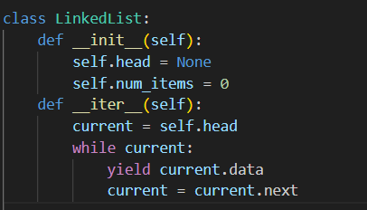
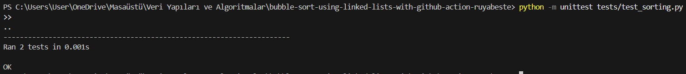

# 📌 Assignment #4 – Sorting with GitHub Actions

## 📋 Project Description
This project implements the **Bubble Sort** algorithm that works with both:
- Python built-in `list`
- A custom `LinkedList` class (manually defined)

The sorting is tested automatically using **unittest** and **GitHub Actions** workflows.

---

## 📌 Steps Followed

| Step No | Description                                                                 |
|---------|-----------------------------------------------------------------------------|
| 1       | Cloned the GitHub repository to local machine                              |
| 2       | Edited `bubble_sort()` function to support both Python list and LinkedList |
| 3       | Implemented `__iter__()` in `LinkedList` to enable iteration and testing   |
| 4       | Wrote new test function `test_bubble_sort_linked_list` in `test_sorting.py`|
| 5       | Ran tests using `unittest` module and verified successful execution        |
| 6       | Set up GitHub Actions workflow in `.github/workflows/python-tests.yml`     |
| 7       | Made commits and pushed the changes to the GitHub repository               |                       |
| 8      | Prepared and structured the `README.md` file with descriptions and visuals |

---

### 1️⃣ Step 1 – Cloning the GitHub Repository

The first step was to clone the GitHub repository to my local machine using the `git clone` command.

📸 Screenshot:

This downloaded the project folder structure onto my computer and allowed me to begin working with the codebase in VS Code.

### 2️⃣ Step 2 – Editing `bubble_sort()` to Support LinkedList

The original `bubble_sort()` function worked only with Python lists. In this step, I extended it to also support a custom `LinkedList` class.

To do this, I used Python's built-in `isinstance()` function to check the type of the input:
- If it’s a `list`, perform standard bubble sort using index-based iteration.
- If it’s a `LinkedList`, perform bubble sort by traversing nodes and swapping `node.data`.

📸 Screenshot:

This change allowed the same sorting function to be tested and used with both Python’s native structures and our custom class.

🧠 **bubble_sort() Logic**
- Supports both data types in one function.
- Swaps values of adjacent `Node`s for `LinkedList`.
- Avoids modifying node connections – only data values change.
  
### 3️⃣ Step 3 – Adding `__iter__()` to `LinkedList`

To make the custom `LinkedList` iterable (i.e., usable in `for` loops and `list()` conversions), I added an `__iter__()` method to the class.

📸 Screenshot:

This method was critical for integrating the custom LinkedList structure with Python’s standard tools like list() and unittest.

🧠**Why __iter__() Matters**

- Without it, unit tests like list(linked_list) would raise a TypeError.
- Enables use of assertEqual(list(linked_list), [...]) in test cases.
- Makes debugging and printing much easier.

### 4️⃣ Step 4 – Writing Unit Tests for Both List and LinkedList

After implementing the `bubble_sort()` logic and `__iter__()` method,  added test cases in the `tests/test_sorting.py` file.
Using Python’s built-in `unittest` module, I tested:
- Sorting of a regular Python list
- Sorting of a custom `LinkedList`

📸 Screenshot:

🧠 **Key Testing Points**
- The `list(linked_list)` conversion allows comparison using `assertEqual`
- `LinkedList` test confirms that sorting logic works on custom structures

### 5️⃣ Step 5 – Running Tests in Terminal

After writing the unit tests, I ran them locally using Python’s `unittest` framework to ensure both implementations (list and LinkedList) passed all assertions.

🧠 **What This Does**
- Discovers and runs all test functions in test_sorting.py
- Shows whether tests pass or fail
- Helps debug before pushing to GitHub

📸 Screenshot:

### 6️⃣ Step 6 – Running Tests Automatically with GitHub Actions

To automate testing after each code update, GitHub Actions was used. The `.yml` workflow file required to trigger tests was **provided by the instructor**.

📌 What It Does:
- Runs on every push or pull request to the `main` branch
- Installs Python and required packages
- Automatically discovers and runs `unittest` tests inside the `tests/` directory

🧠 **Why This Is Useful**
- Ensures every code update is automatically tested
- Helps maintain code reliability and avoids manual mistakes
- Works even if I forget to run tests locally

📸 Screenshot:

### 7️⃣ Step 7 – Committing and Pushing to GitHub

After making all the necessary code changes and verifying that the tests passed locally, I staged the changes and pushed them to the GitHub repository.

📸 Screenshot:

### 📌 Additional Notes

## 🔍 Understanding Error vs Failure in Unit Testing

| Type    | What It Means                                                                | Example Case                              |
|---------|-------------------------------------------------------------------------------|-------------------------------------------|
| Error   | The test crashes or cannot run due to an exception (code problem)            | `AttributeError`, `TypeError`, `IndexError` |
| Failure | The test runs but the result is incorrect (logic problem)                    | `assertEqual([1,2], [2,1])` fails         |

 📌 🔴 "Error" Example from My Code:

If the `__iter__()` method was **not** implemented in the `LinkedList` class, this test would raise a `TypeError`:

'''
linked_list = convert_to_linked_list([2, 1])
self.assertEqual(list(linked_list), [1, 2]) '''

Output:
TypeError: 'LinkedList' object is not iterable

📌 🟠 "Failure" Example from My Code:
If the bubble_sort() function incorrectly handled node swaps, the test would fail like this:

'''
linked_list = convert_to_linked_list([2, 1])
sorted_ll = bubble_sort(linked_list)
self.assertEqual(list(sorted_ll), [1, 2]) '''

Output: 
AssertionError: Lists differ: [2, 1] != [1, 2]

## 🔍 Use of AI

I used AI during this assignment to assist me in the following ways:

- 🧠 Understanding how to adapt `bubble_sort()` for a custom `LinkedList` class
- 🧪 Clarifying how Python's `__iter__()` works and why it's important for testing
- 🔍 Interpreting the difference between unit test **errors** and **failures** with real examples
- 🛠 Debugging small issues like test failures and iteration logic
- 💬 Improving the clarity and technical accuracy of my written documentation

I asked for guidance, explained my code and decisions, and revised things myself with support from the AI.