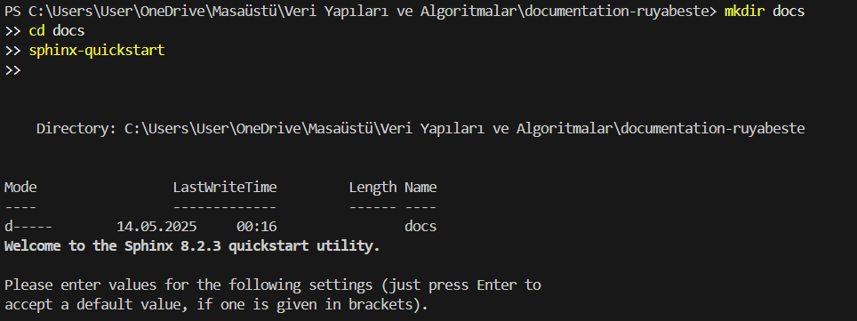
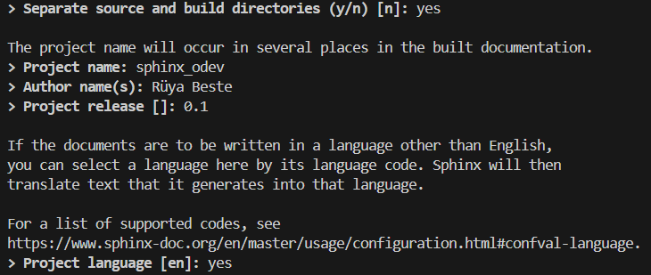
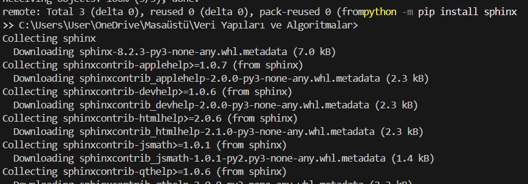
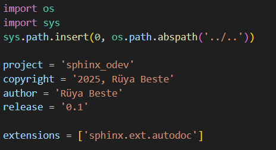
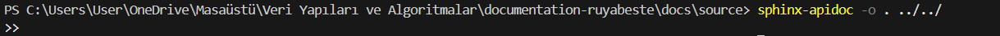
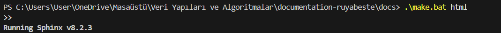
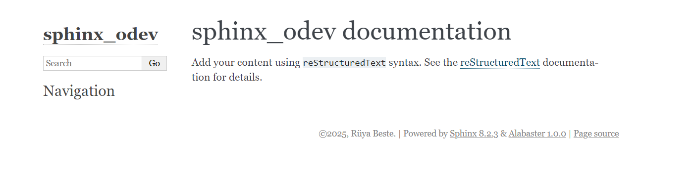
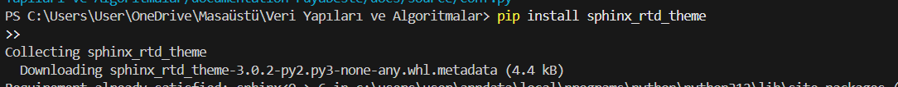
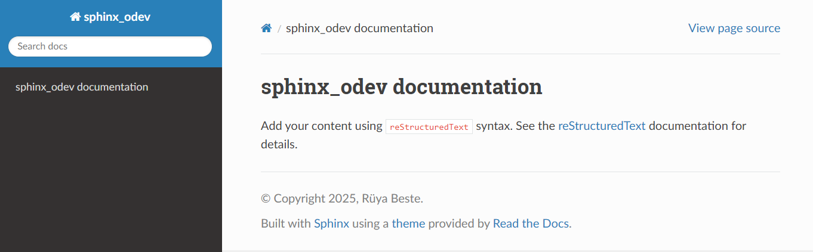

# 📘 Assignment #5 – Sphinx Documentation

This project demonstrates how to generate HTML documentation using **Sphinx** in Python. Below are the steps I followed, along with screenshots and notes.

### Setup Steps

1️⃣ Created docs/ folder and ran sphinx-quickstart

2️⃣ Answered configuration questions
I enabled separate source/build, set project name and author, and used English language.

3️⃣ Installed Sphinx

4️⃣ Edited conf.py with autodoc

5️⃣ Ran sphinx-apidoc to generate .rst files

6️⃣ Built HTML output using Alabaster theme

7️⃣ Viewed output in browser (Alabaster theme)

Opened index.html in the browser to verify output.

8️⃣ Installed and tested sphinx_rtd_theme

pip install sphinx_rtd_theme

| Theme           | Description                   | Preview                          |
|----------------|-------------------------------|----------------------------------|
| Alabaster       | Simple and clean              |  |
| sphinx_rtd_theme| Sidebar layout, modern look   |  |

✅ I preferred sphinx_rtd_theme because it offers better navigation and structure, especially for larger documentation.
