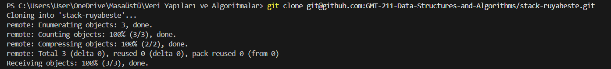
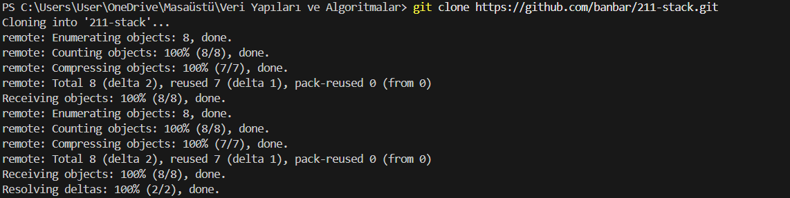
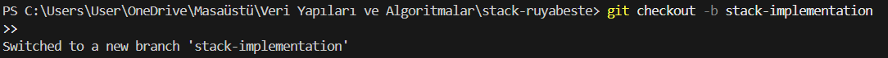
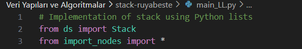
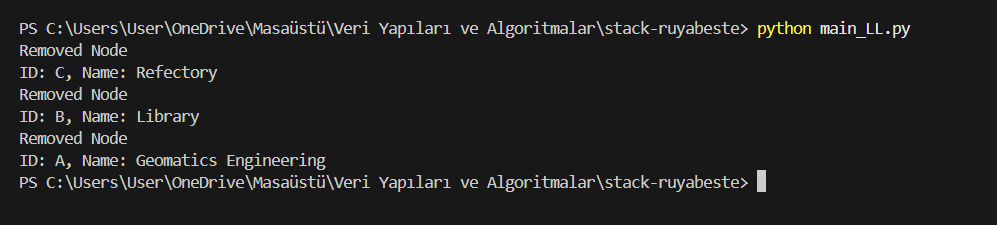
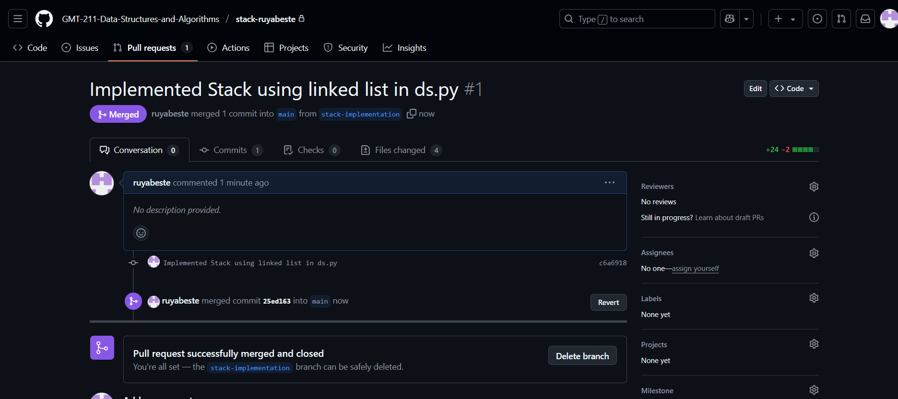

# Assignment #3 – Stack Implementation using Linked List

This project is developed as part of the Git/GitHub assignment. The goal is to implement the Stack data structure using a linked list in Python and manage the development process using Git branches.

---

## 🧪 Commands I Used

| Command                                  | Purpose                                                  |
|------------------------------------------|----------------------------------------------------------|
| `git clone <repo-url>`                  | Clone the GitHub repo to local machine                  |
| `cd <folder-name>`                      | Move into the project folder                            |
| `git checkout -b stack-implementation`  | Create and switch to a new branch                       |
| `code ds.py`                            | Create and open the Python file for the stack class     |
| `git add .`                             | Stage all changes for commit                            |
| `git commit -m "..."`                   | Commit staged changes with a message                    |
| `git push origin stack-implementation` | Push branch to GitHub                                   |
| `python main_LL.py`                    | Run the program to test linked list-based stack         |
| `git checkout main`                     | Switch back to main branch                              |
| `git merge stack-implementation`        | Merge feature branch into main                          |
| `git push origin main`                  | Push updated main branch to GitHub                      |

## 📌 Steps I Did for This Assignment:

1. **Cloned the repository from GitHub Classroom**
   

2. **Transferred files from the starter repository**
- Copied main_LL.py, import_nodes.py, coordinates.csv and others

3. **Created a new branch for development**
   

4. **Created ds.py file and implemented the data structure**

- Created 3 classes: LinkedListNode, LinkedList, and Stack.
- Used LinkedList inside the Stack class.
- Implemented required methods: push(node), pop(), peek().
- I got help from AI while doing this file.

1. **Connected main_LL.py with ds.py**

- Used from ds import *
- Pushed coordinates from the CSV into the stack and printed them after popping

6. **Tested the code**
 

7. **Committed all work and pushed to GitHub**

8. **Created a pull request and merged the branch**

- Opened a PR on GitHub
- Merged into main using GitHub interface

9.  **Prepared this README file**

🎓 What I Learned From This Assignment

- I practiced version control using Git, such as creating and switching branches, committing changes, and merging.
- I tested the program using main_LL.py, and confirmed that the push() and pop() operations work correctly with a linked list-based stack.
- This assignment helped me better understand the LIFO (Last-In, First-Out) principle:
The last node added to the stack is the first one to be removed — just like a stack of plates where you always remove the top one first.